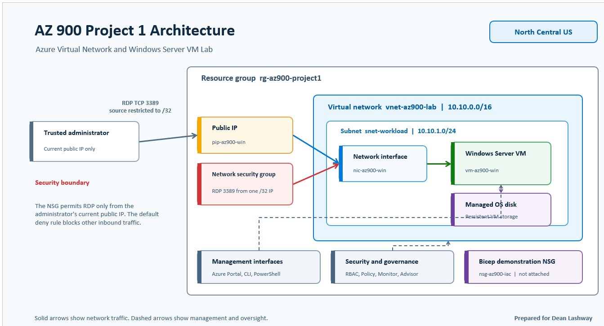

# AZ-900 Azure VM and Virtual Network Lab

## Project overview

This beginner-friendly project creates a small Azure environment in **North Central US**. 
It includes a resource group, virtual network, subnet, Windows Server virtual machine, 
network security group, monitoring, governance reviews, command-line administration, and a basic Bicep deployment.

The project demonstrates how cloud resources are organized, protected, monitored, 
automated, and documented for a public GitHub portfolio.

## Objectives

- Create an Azure resource group and organize resources with tags.
- Build a virtual network using `10.10.0.0/16` and a workload subnet using `10.10.1.0/24`.
- Deploy a Windows Server virtual machine in North Central US.
- Restrict Remote Desktop access to one trusted public IP address using `/32`.
- Review Azure RBAC, Azure Policy, monitoring, recommendations, and cost controls.
- Inspect resources with Azure CLI and Azure PowerShell.
- Validate and deploy a separate demonstration NSG with Bicep.
- Save sanitized evidence without exposing credentials or account information.

## Architecture

| Resource | Lab configuration |
|---|---|
| Resource group | `rg-az900-project1` |
| Region | North Central US |
| Virtual network | `vnet-az900-lab` |
| VNet address space | `10.10.0.0/16` |
| Subnet | `snet-workload` |
| Subnet address range | `10.10.1.0/24` |
| Virtual machine | `vm-az900-win` |
| Bicep demonstration NSG | `nsg-az900-iac` |

The Bicep demonstration NSG is a separate learning resource and is not attached to the virtual machine.

## Azure services used

- Azure Resource Groups and tags
- Azure Virtual Network and subnet
- Azure Virtual Machines, network interface, public IP, and managed disk
- Network Security Groups
- Azure Monitor and Activity Log
- Azure Advisor and Service Health
- Azure Cost Management and budgets
- Azure role-based access control (RBAC)
- Azure Policy
- Azure Cloud Shell, Azure CLI, and Azure PowerShell
- Azure Bicep

## Security and cost controls

- RDP on TCP port 3389 was limited to the administrator's trusted public IP address using a `/32` source range. 
  This reduces exposure to internet scanning and password attacks.
- Azure's default NSG rules deny other unsolicited inbound connections.
- RBAC roles were reviewed to understand least privilege and avoid unnecessary Owner or Contributor access.
- Azure Policy was reviewed to understand how organizations audit or restrict configurations such as allowed regions.
- A budget and cost alert were configured, and VM auto-shutdown was reviewed to reduce unexpected charges.
- Screenshots and command output must be sanitized before publication. Passwords, email addresses, subscription IDs, 
  tenant IDs, and public IP addresses must not be committed to GitHub.
- Billable resources should be deleted after all required evidence has been collected.

## Validation results

- Confirmed that `snet-workload` is inside the `10.10.0.0/16` VNet address space and uses the non-overlapping range `10.10.1.0/24`.
- Verified that the virtual network and VM were deployed in North Central US.
- Confirmed that the RDP rule uses a trusted `/32` source rather than `Any` or `0.0.0.0/0`.
- Used Azure CLI and Azure PowerShell to view deployed resources and their configuration.
- Validated the Bicep file and reviewed the proposed changes with `what-if` before deployment.
- Confirmed the Bicep deployment and the creation of `nsg-az900-iac` in North Central US.
- Recorded cleanup evidence after removing the lab resources.

## Evidence

Sanitized screenshots are stored in the screenshots folder.

Evidence includes the resource group, budget, virtual network and subnet, VM overview, restricted NSG rule, 
Windows Server connection, monitoring, Azure CLI, Azure PowerShell, RBAC review, Policy review, Bicep deployment, 
and cleanup. The architecture diagram is stored in `architecture/architecture.png`, 
the Bicep file in `infrastructure/main.bicep`, and the commands used in `commands/commands.md`.

## Lessons learned

- A subnet range must fit completely inside the virtual network address space and begin on a valid boundary.
- Azure Policy can block a deployment when a selected region does not meet an organization's allowed-location rules.
- A `/32` source permits one specific public IP address and is safer than allowing RDP from the entire internet.
- Azure CLI and PowerShell provide repeatable ways to inspect resources instead of relying only on the portal.
- Bicep makes infrastructure repeatable, while validation and `what-if` help identify problems before deployment.
- Monitoring, budgets, auto-shutdown, and cleanup are important parts of safely operating a cloud lab.

## AZ-900 skills demonstrated

- Cloud concepts, shared responsibility, and Infrastructure as a Service (IaaS)
- Azure regions, subscriptions, resource groups, resources, and tags
- Azure compute, networking, IP addressing, storage, and NSGs
- Identity, access, least privilege, RBAC, and governance
- Azure Policy, Azure Monitor, Activity Log, Advisor, and Service Health
- Cost Management, budgets, auto-shutdown, and resource cleanup
- Azure portal, Cloud Shell, Azure CLI, Azure PowerShell, and Bicep
- Security documentation, evidence collection, and safe GitHub publishing

